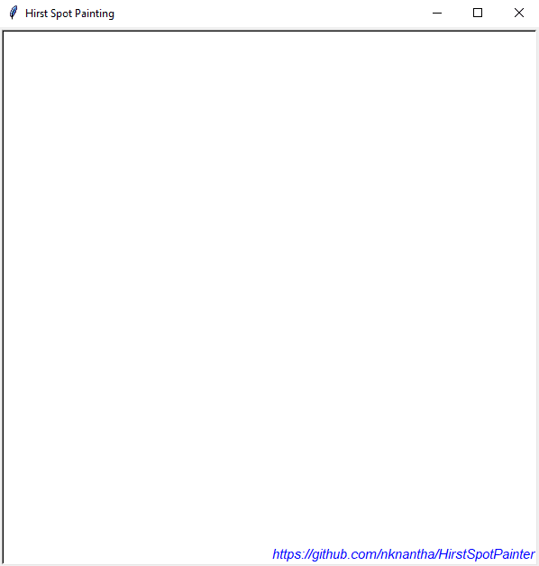
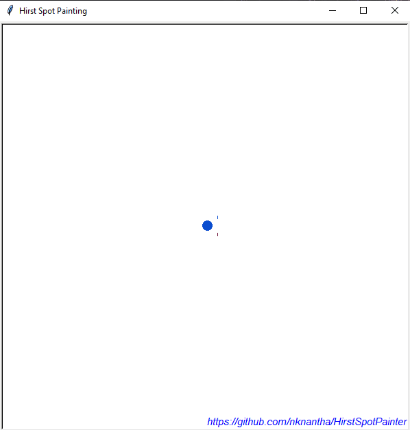

<h1 align='center'>Hirst Spot Painter</h1>

<div align='center'>
✨ A mini-project for doing Hirst Spot Painting on screen, done using 🐍 Python. ✨
</div>
<br>
  
Hirst Painting:  
&nbsp;&nbsp;&nbsp;&nbsp;&nbsp;&nbsp;Damien Steven Hirst is an English artist, who dominated the art
scene in the UK during the 1990s. He is famous for his dot/spot paintings, which contains random
colored dots in some order. [Learn More...📖](https://en.wikipedia.org/wiki/Damien_Hirst).
  
[hirst_spot_painter.py](hirst_spot_painter.py) contains a class `HirstPainter` which takes an image file
and extract colors from the file or takes color values directly and produce Hirst dot/spot painting on
screen. It also provides interactive development support.
  

## Usage
For installing required packages,
```
pip install -r requirements.txt
```

For running example,
```
python hirst_spot_painter.py
```
  

## Documentation
class `HirstPainter`:  
| Parameters | Description |
|:---:|:---|
| size | Takes an integer tuple (width, height). It cannot be less than `(150, 100)`. Default: `(500, 500)`. |
| colors | Takes RGB color tuples or tkinter color strings. Default: `('red', 'green', 'blue')`. |
| image_file | Takes an image file and generate color palette from that. Note that if `image_file` <br> parameter is given colors parameters gets overridden. Default: `None`. |
| color_quality | Takes an integer denotes quality of colors is being taken from `image_file`. <br> `1` means max quality. Lower the quality for improved performance. Default: `5`. |
| color_count | Takes an integer denotes no. of colors is being taken from `image_file`. Default: `20`. |
| pattern | Takes a pattern string. Pattern string must be one of the `('square', 'circle')`. Default: `'square'`. |
  
| Methods | Description |
|:---:|:---|
| change_colors(colors) | Takes a list of RGB tuples or a list of tkinter color strings and changes <br> the current painting. |
| change_pattern(pattern) | Changes the pattern and repaints it with given pattern name. |
| finalize() | Invokes the window's mainloop. After this changes cannot be done. |
| screen_size(x, y) | Takes x(width) and y(height) values and changes the screen and repaint. <br> Values cannot be less than `(150, 100)`. |
| refresh_image(image_file) | Refresh painting with current image file or with new image file. |
  

## Examples

### Input:  


*Photo by Steve Johnson from Pexels*
  
### Output:  
For,
```python
HirstSpotPainter(size=(600, 600), image_file='Images/Image.jpg').finalize()
```

  
For,
```python
HirstSpotPainter(size=(600, 600), image_file='Images/Image.jpg', pattern='circle').finalize()
```

